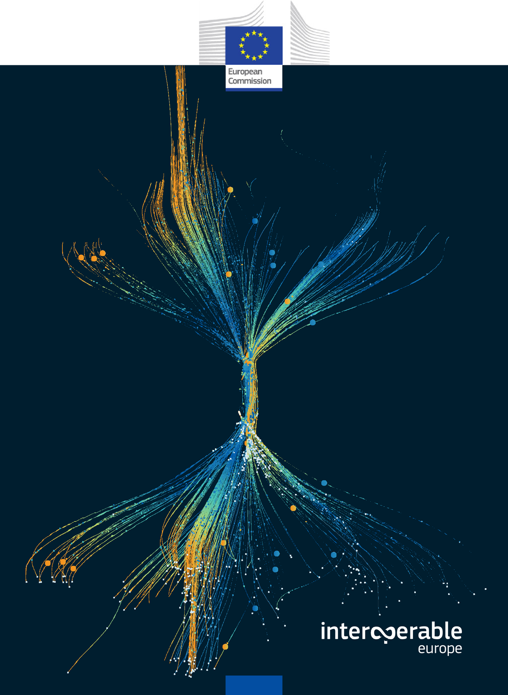
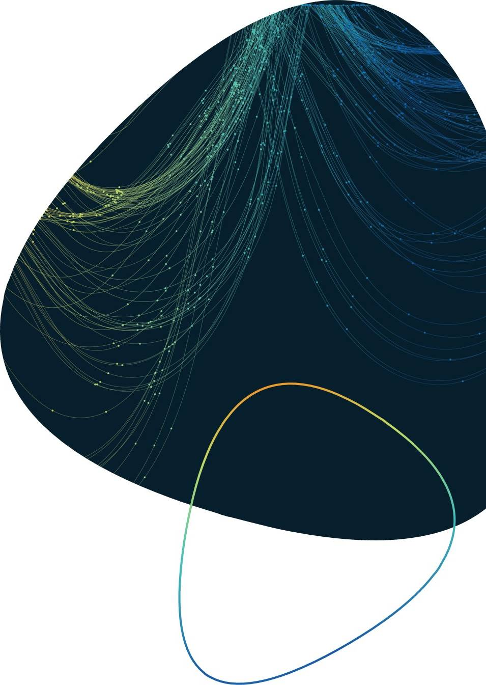
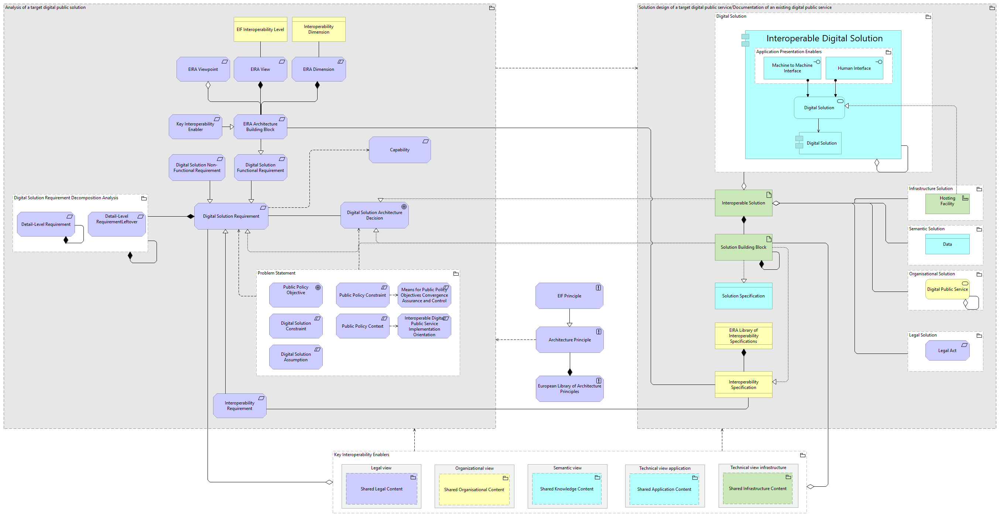
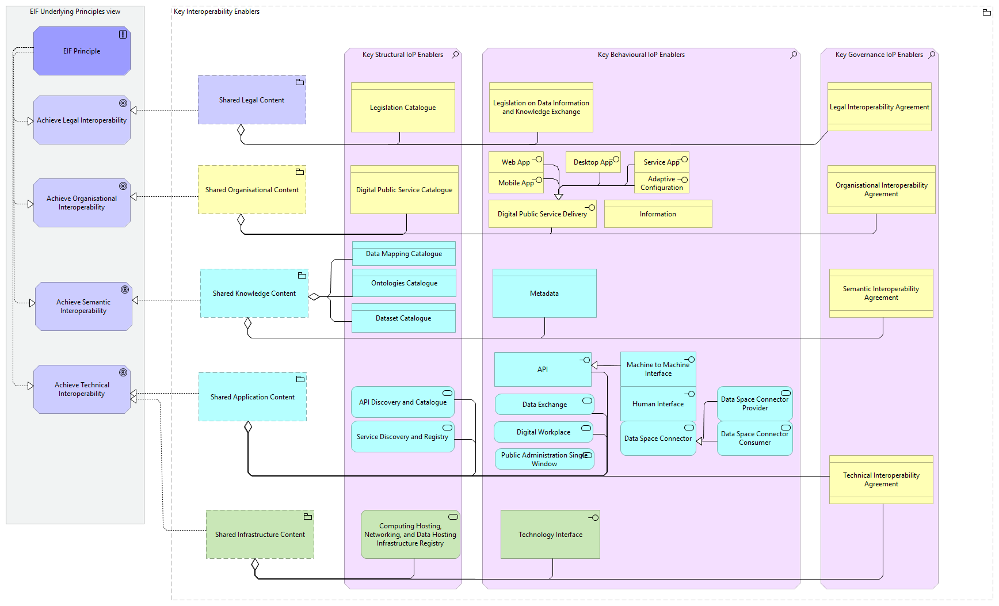
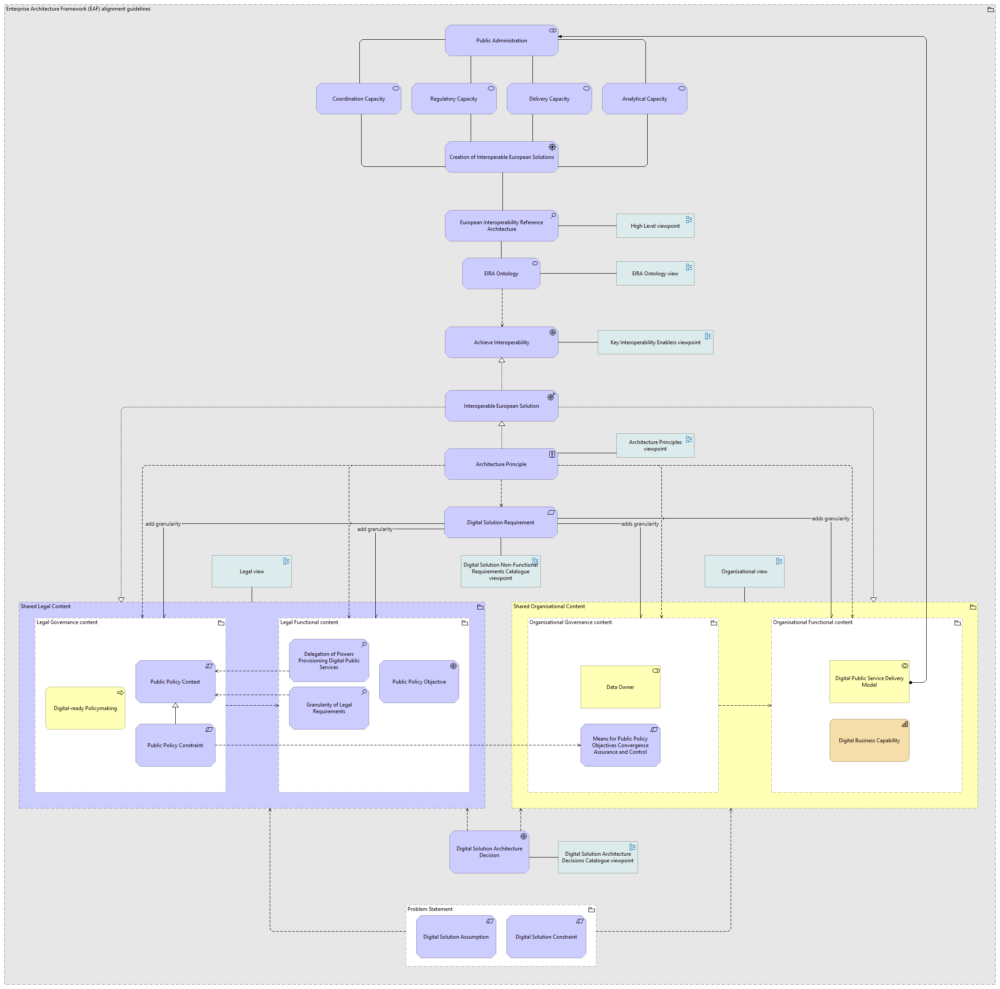

Appendices
==========

Glossary of Key Terms
---------------------

[Add table with ABB name + PURI of EIRA]

Abbreviations list
------------------

+------------------+---------------+-----------------------------------+
| **Abbreviation** | **Term**      | **Description**                   |
+==================+===============+===================================+
| XXX              | XX            | XXXX                              |
+------------------+---------------+-----------------------------------+
| XXX              | XX            | XXXX                              |
+------------------+---------------+-----------------------------------+
| XXX              | XX            | XXXX                              |
+------------------+---------------+-----------------------------------+
| XXX              | XX            | XXXX                              |
+------------------+---------------+-----------------------------------+

Templates for ABB/SBB definition and capability assessment.
-----------------------------------------------------------

As part of the Solution Architecture Framework, another tool from the
Interoperable Architecture Action is presented as part of the toolbox to
support the analysis and design of digital public services: the CarTool.
Within the CarTool, it is possible to reuse directly ABBs and SBBs from
EIRA and eGovERA, ensuring consistency and completeness of properties.

The following table illustrates the basic ABB properties that the
Reference Architecture adds:

+------------------+--------------------------------+-------------------------------+
| Name             | Property                       | Value description             |
+==================+================================+===============================+
| Identifier       | eira:PURI                      | Provides the persistent and   |
|                  |                                | unique identifier of the      |
|                  |                                | element within the EIRA       |
|                  |                                | namespace.                    |
+------------------+--------------------------------+-------------------------------+
| ABB name         | dct:type                       | Specifies the type of the     |
|                  |                                | element, including its name   |
|                  |                                | and the corresponding         |
|                  |                                | ArchiMate element             |
|                  |                                | classification.               |
+------------------+--------------------------------+-------------------------------+
| Date modified    | dct:modified                   | Records the date on which the |
|                  |                                | element was last modified.    |
+------------------+--------------------------------+-------------------------------+
| Synonym          | eira:synonym                   | Provides one or more          |
|                  |                                | alternative labels that may   |
|                  |                                | be used to refer to the same  |
|                  |                                | element in different          |
|                  |                                | contexts, without altering    |
|                  |                                | its defined meaning.          |
+------------------+--------------------------------+-------------------------------+
| Definition       | skos:definition                | Provides the formal           |
|                  |                                | definition of the             |
|                  |                                | Architecture Building Block   |
|                  |                                | (ABB).                        |
+------------------+--------------------------------+-------------------------------+
| Source           | eira:definitionSource          | Identifies the authoritative  |
|                  |                                | source from which the         |
|                  |                                | definition of the element is  |
|                  |                                | derived.                      |
+------------------+--------------------------------+-------------------------------+
| Source Reference | eira:definitionSourceReference | Provides a reference (e.g.    |
|                  |                                | URL or bibliographic pointer) |
|                  |                                | to the definition source,     |
|                  |                                | enabling traceability and     |
|                  |                                | verification.                 |
+------------------+--------------------------------+-------------------------------+
| Example          | skos:example                   | Provides illustrative         |
|                  |                                | examples that complement the  |
|                  |                                | definition and help clarify   |
|                  |                                | the intended meaning or usage |
|                  |                                | of the element.               |
+------------------+--------------------------------+-------------------------------+
| Interoperability | eira:iopSaliency               | Describes why the ABB or SBB  |
| Saliency         |                                | is relevant and significant   |
|                  |                                | for achieving                 |
|                  |                                | interoperability,             |
|                  |                                | highlighting its contribution |
|                  |                                | to interoperability outcomes. |
+------------------+--------------------------------+-------------------------------+
| Addtitional      | skos:note                      | Provides additional           |
| Information      |                                | explanatory information,      |
|                  |                                | remarks, or clarifications    |
|                  |                                | that do not form part of the  |
|                  |                                | formal definition.            |
+------------------+--------------------------------+-------------------------------+
| EIRA concept     | eira:concept                   | Indicates the conceptual      |
|                  |                                | classification of the         |
|                  |                                | element, specifying whether   |
|                  |                                | it is an Architecture         |
|                  |                                | Building Block (ABB), a       |
|                  |                                | Solution Building Block       |
|                  |                                | (SBB), or an EIRA ontology    |
|                  |                                | element.                      |
+------------------+--------------------------------+-------------------------------+
| Interoperability | eira:iopDimension              | Specifies the                 |
| Dimension        |                                | interoperability dimension    |
|                  |                                | addressed by the element,     |
|                  |                                | such as Structural,           |
|                  |                                | Behavioural, or Governance    |
|                  |                                | Interoperability.             |
+------------------+--------------------------------+-------------------------------+
| LOST view        | eira:view                      | Indicates the LOST view(s) in |
|                  |                                | which the element is          |
|                  |                                | represented.                  |
+------------------+--------------------------------+-------------------------------+
| Additional       | dct:identifier                 | Provides an additional        |
| identifier       |                                | identifier for the element,   |
|                  |                                | using the same format as      |
|                  |                                | eira:PURI, to support         |
|                  |                                | interoperability with         |
|                  |                                | external catalogues or        |
|                  |                                | systems.                      |
+------------------+--------------------------------+-------------------------------+
| EIF Layer        | eira:eifLayer                  | Identifies the European       |
|                  |                                | Interoperability Framework    |
|                  |                                | (EIF) layer to which the      |
|                  |                                | element belongs. The value is |
|                  |                                | expressed in camelCase for    |
|                  |                                | machine readability (e.g.     |
|                  |                                | technicalApplication).        |
+------------------+--------------------------------+-------------------------------+

The following table shows the properties that Solution Building Blocks
include, they are very much aligned with ABBs, but include slight
modifications. There are three main changes: dct:description,
dct:publisher, and dct:source, and obeys to the following logic:

ABBs represent abstract, architectural concepts that define
interoperability requirements and do not exist as distributable or
maintained artefacts; therefore, they use skos:definition together with
eira:definitionSource and eira:definitionSourceReference to ensure
semantic precision and traceability to authoritative sources. In
contrast, SBBs represent concrete, real-world artefacts that realise
ABBs and are implemented, published, and maintained by identifiable
actors; accordingly, they use dct:description, dct:publisher, and
dct:source to capture practical descriptions, responsibility, and
provenance. This distinction preserves a clear separation between
conceptual architectural intent and operational solution realisation
within EIRA.

+------------------+-----------------------+-------------------------------+
| Name             | Property              | Value description             |
+==================+=======================+===============================+
| Identifier       | eira:PURI             | Provides the persistent and   |
|                  |                       | unique identifier of the      |
|                  |                       | element within the EIRA       |
|                  |                       | namespace.                    |
+------------------+-----------------------+-------------------------------+
| ABB name         | dct:type              | Specifies the type of the     |
|                  |                       | element, including its name   |
|                  |                       | and the corresponding         |
|                  |                       | ArchiMate element             |
|                  |                       | classification.               |
+------------------+-----------------------+-------------------------------+
| Date modified    | dct:modified          | Records the date on which the |
|                  |                       | element was last modified.    |
+------------------+-----------------------+-------------------------------+
| Synonym          | eira:synonym          | Provides one or more          |
|                  |                       | alternative labels that may   |
|                  |                       | be used to refer to the same  |
|                  |                       | element in different          |
|                  |                       | contexts, without altering    |
|                  |                       | its defined meaning.          |
+------------------+-----------------------+-------------------------------+
| Definition       | dct:description       | Provides the formal           |
|                  |                       | definition of the Solution    |
|                  |                       | Building Block (SBB).         |
+------------------+-----------------------+-------------------------------+
| Source           | dct:publisher         | Identifies the authoritative  |
|                  |                       | source from which the         |
|                  |                       | definition of the element or  |
|                  |                       | is derived or reference to    |
|                  |                       | the publisher of the          |
|                  |                       | solution.                     |
+------------------+-----------------------+-------------------------------+
| Source Reference | dct:source            | Provides a reference (e.g.    |
|                  |                       | URL or bibliographic pointer) |
|                  |                       | to the definition source,     |
|                  |                       | enabling traceability and     |
|                  |                       | verification.                 |
+------------------+-----------------------+-------------------------------+
| Example          | skos:example          | Provides illustrative         |
|                  |                       | examples that complement the  |
|                  |                       | definition and help clarify   |
|                  |                       | the intended meaning or usage |
|                  |                       | of the element.               |
+------------------+-----------------------+-------------------------------+
| Interoperability | eira:iopSaliency      | Describes why the ABB or SBB  |
| Saliency         |                       | is relevant and significant   |
|                  |                       | for achieving                 |
|                  |                       | interoperability,             |
|                  |                       | highlighting its contribution |
|                  |                       | to interoperability outcomes. |
+------------------+-----------------------+-------------------------------+
| Addtitional      | skos:note             | Provides additional           |
| Information      |                       | explanatory information,      |
|                  |                       | remarks, or clarifications    |
|                  |                       | that do not form part of the  |
|                  |                       | formal definition.            |
+------------------+-----------------------+-------------------------------+
| EIRA concept     | eira:concept          | Indicates the conceptual      |
|                  |                       | classification of the         |
|                  |                       | element, specifying whether   |
|                  |                       | it is an Architecture         |
|                  |                       | Building Block (ABB), a       |
|                  |                       | Solution Building Block       |
|                  |                       | (SBB), or an EIRA ontology    |
|                  |                       | element.                      |
+------------------+-----------------------+-------------------------------+
| Interoperability | eira:iopDimension     | Specifies the                 |
| Dimension        |                       | interoperability dimension    |
|                  |                       | addressed by the element,     |
|                  |                       | such as Structural,           |
|                  |                       | Behavioural, or Governance    |
|                  |                       | Interoperability.             |
+------------------+-----------------------+-------------------------------+
| LOST view        | eira:view             | Indicates the LOST view(s) in |
|                  |                       | which the element is          |
|                  |                       | represented.                  |
+------------------+-----------------------+-------------------------------+
| Additional       | dct:identifier        | Provides an additional        |
| identifier       |                       | identifier for the element,   |
|                  |                       | using the same format as      |
|                  |                       | eira:PURI, to support         |
|                  |                       | interoperability with         |
|                  |                       | external catalogues or        |
|                  |                       | systems.                      |
+------------------+-----------------------+-------------------------------+
| EIF Layer        | eira:eifLayer         | Identifies the European       |
|                  |                       | Interoperability Framework    |
|                  |                       | (EIF) layer to which the      |
|                  |                       | element belongs. The value is |
|                  |                       | expressed in camelCase for    |
|                  |                       | machine readability (e.g.     |
|                  |                       | Technical Application, Legal, |
|                  |                       | etc.).                        |
+------------------+-----------------------+-------------------------------+

Reference Architecture Persistent URI schema
--------------------------------------------

The Reference Architecture include the Persistent URI (PURI), as can be
read in the tables above. It was requested to The Publications Office of
the European Union, and follows the following schema:

`http://data.europa.eu/dr8/ <http://data.europa.eu/dr8/LegalActRequirement>`__

This is the root for the EIRA, and the PURIs for the different ABBs are
build upon that, specifically adding the element name and the element
type from ArchiMate. An example:

http://data.europa.eu/dr8/LegalActRequirement

In the case of eGovERA Business Agnostic and the domain specific
reference architecture, the PURI builds on the EIRA one, adding
“/egovera/elementNameElement type. An example:

http://data.europa.eu/dr8/egovera/EuropeanInteroperabilityTestBedApplicationService

Normative References
--------------------

- Enterprise Interoperability Frameworks (e.g., EIF).

- ArchiMate Specification, The Open Group.

- RFC 2119: Key words for use in RFCs to Indicate Requirement Levels,
  IETF.

- Existing Building Block Documentation (e.g., identity management, data
  exchange, trust services).

Non-Normative References
------------------------

- TOGAF® Standard, The Open Group.

- W3C Semantic Web Standards.

- Case studies of Reference Architecture adoption.

- Academic and practitioner literature.

Bibliographic References (Web, Documents, Books, Institutions, etc)
-------------------------------------------------------------------

.. [1]
   Digital public services and environments:
   https://digital-strategy.ec.europa.eu/en/policies/digital-public-services

.. [2]
   ArchiMate© licensed downloads:
   https://www.opengroup.org/archimate-licensed-downloads

.. [3]
   The Open Group: https://www.opengroup.org/

.. [4]
   Public Governance Institute, KU Leuven:
   https://soc.kuleuven.be/io/english/

.. [5]
   eGovERA Health Reference Architecture:
   https://interoperable-europe.ec.europa.eu/collection/european-interoperability-reference-architecture-eira/solution/egovera-health

.. [6]
   eGovERA Customs Reference Architecture:
   https://interoperable-europe.ec.europa.eu/collection/european-interoperability-reference-architecture-eira/solution/egovera-customs

.. [7]
   eGovERA Tax Reference Architecture:
   https://interoperable-europe.ec.europa.eu/collection/european-interoperability-reference-architecture-eira/solution/egovera-taxes

.. [8]
   Data Space and Linked Data in Flanders:
   https://interoperable-europe.ec.europa.eu/collection/european-interoperability-reference-architecture-eira/news/egoverac-success-story-data-space-and-linked-data-flanders

.. [9]
   Data Space with the Council of Madrid:
   https://interoperable-europe.ec.europa.eu/collection/european-interoperability-reference-architecture-eira/news/egoverac-success-data-space-council-madrid

.. [10]
   ViDA invoicing requirements with DG TAXUD:
   https://interoperable-europe.ec.europa.eu/collection/european-interoperability-reference-architecture-eira/news/egoverac-success-vida-e-invoicing-requirements-dg-taxud

.. [11]
   EIRA and ITB with CACSA:
   https://interoperable-europe.ec.europa.eu/collection/european-interoperability-reference-architecture-eira/news/first-public-procurement-use-case-eirac-and-itb-cacsa

.. [12]
   Semantic versioning: https://semver.org/

.. [13]
   Interoperability Architecture Solutions:
   https://interoperable-europe.ec.europa.eu/collection/european-interoperability-reference-architecture-eira

.. [14]
   Interoperability Architecture GitHub Repositories:
   https://github.com/CarTool-EC?tab=repositories

.. |A screenshot of a computer AI-generated content may be incorrect.| image:: ./images/media/image7.png
   :width: 6.67847in
   :height: 1.74861in
.. |image2| image:: ./images/media/image8.png
   :width: 5.66694in
   :height: 3.54021in
.. |Gráfico, Escala de tiempo El contenido generado por IA puede ser incorrecto.| image:: ./images/media/image11.png
   :width: 6.36875in
   :height: 1.88336in

.. |A screenshot of a computer AI-generated content may be incorrect.| image:: ./images/media/image7.png
   :width: 6.67847in
   :height: 1.74861in
.. |image2| image:: ./images/media/image8.png
   :width: 5.66694in
   :height: 3.54021in
.. |Gráfico, Escala de tiempo El contenido generado por IA puede ser incorrecto.| image:: ./images/media/image11.png
   :width: 6.36875in
   :height: 1.88336in