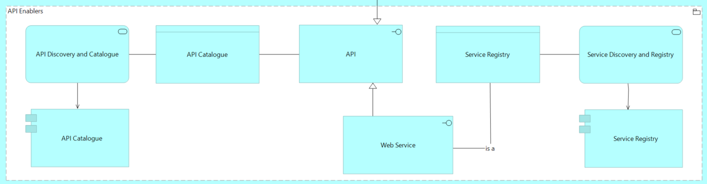
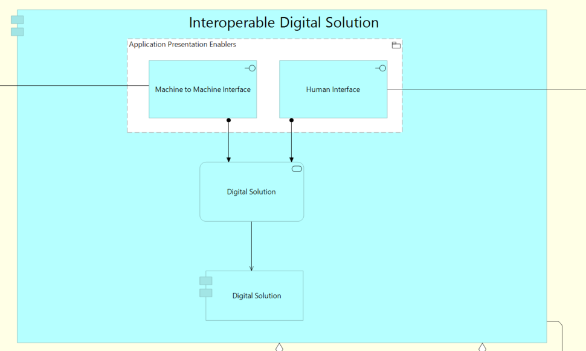

Architecture Building Blocks (ABBs)
===================================

Definition and role of Architecture Building Blocks
---------------------------------------------------

As introduced in Section 2, Architecture Building Blocks (ABBs) and
Solution Building Blocks (SBBs) constitute the fundamental components
through which EIRA and eGovERA express architectural requirements and
their realisations. This section provides detailed explanation of
Architecture Building Blocks, their characteristics, and their
application within the reference architectures.

Architecture Building Blocks represent requirements that define the
necessary capabilities for achieving interoperability within digital
public services. In the context of EIRA, an ABB acts as a requirement of
intermediate granularity, aligned one or several principles from the
European Interoperability Framework. Each EIRA ABB is formulated as an
agreed normative statement in functional terms, addressing legal,
organisational, semantic, or technical attributes of a target European
public service.

ABBs describe what capabilities are required rather than how they should
be implemented. They shape the specification of Solution Building Blocks
by defining the functional requirements and interoperability
characteristics that implementations must satisfy. This separation
between requirements (ABBs) and implementations (SBBs) enables
technology neutrality whilst providing clear guidance on what must be
achieved to ensure interoperability.

The role of ABBs is key in both phases, analysis and design of digital
public services. During the Analysis use case (as described in Section
2.5), ABBs provide a structured framework for identifying and
documenting interoperability requirements. Architects examine which ABBs
are relevant to their digital public service and document them as
requirements that the solution must satisfy. In turn, during the Design
use case, ABBs become the specifications that Solution Building Blocks
must fulfil. Each selected SBB must demonstrably address one or more
ABBs, ensuring traceability between requirements and implementation
decisions. This dual role ensures continuity between analysis and design
activities whilst maintaining clear distinction between "what" must be
achieved and "how" it will be accomplished.

EIRA Architecture Building Blocks possess several defining
characteristics that distinguish them from other architectural concepts
and determine how they should be applied:

- **Technology neutrality:** ABBs are formulated without reference to
  specific technologies, products, or implementation approaches. They
  express requirements in terms of capabilities and functional
  characteristics rather than technical solutions. This neutrality
  ensures that multiple implementation approaches can satisfy the same
  ABB.

- **Granularity and decomposition:** ABBs exist at intermediate
  granularity—more specific than high-level capability statements but
  more abstract than detailed technical requirements. Some ABBs may be
  decomposed into more detailed constituent ABBs, creating hierarchical
  relationships that enable analysis at different levels of detail
  depending on architecture development stage and stakeholder needs.

To better illustrate the definition and content provided, a few examples
are included below together with the explanation and reference to the
aspects introduced above. It is relevant to mention and remark that
these examples might change over time and EIRA versions. However, the
examples together with the explanations are good and key to understand
the role of ABBs and their characteristics.

|A screenshot of a computer AI-generated content may be incorrect.|

The image above represents the API enablers, which are is a grouping
that referes to a coherent set of application-level building blocks that
support the design, exposure, discovery, registration, and cataloguing
of (open) software interfaces (APIs). Below some examples of the ABBs in
the grouping:

- **API Discovery and Catalogue** is an Architecture Building Block that
  defines the requirement for public service APIs to be discoverable and
  described in a structured, accessible manner. This ABB expresses the
  capability needed to publish, classify, and expose information about
  available APIs so that potential consumers can identify and assess
  their suitability for reuse.

From an analysis perspective, this ABB is used to document the
requirement that APIs supporting a digital public service must be made
visible and understandable to other organisations and systems.
Architects identify whether API discoverability is necessary to support
cross-border or cross-sector interoperability and capture this need
independently of any specific tooling.

- The **API** Architecture Building Block defines the requirement for
  functionality to be exposed through well-defined, machine-readable
  interfaces. This ABB captures the capability to make services
  accessible in a consistent and interoperable way, enabling
  communication between systems across organisational boundaries.

During analysis, this ABB allows architects to state that certain
business or technical capabilities must be exposed via APIs, supporting
reuse, automation, and interoperability. The ABB does not prescribe
whether the API is RESTful, event-driven, synchronous, or asynchronous,
but establishes the requirement that an interface-based interaction
model is needed.

- The **Service Registry** Architecture Building Block defines the
  requirement for maintaining authoritative information about available
  services and their endpoints. It supports interoperability by ensuring
  that services can be reliably identified, located, and referenced at
  runtime or design time.

In the analysis phase, this ABB is used to capture the need for service
registration as part of the digital public service architecture.
Architects may identify this requirement when services are distributed
across multiple organisations or environments and dynamic service
discovery is needed.

Relationships and Dependencies Between Architecture Building Blocks
-------------------------------------------------------------------

Architecture Building Blocks do not exist in isolation but form networks
of relationships that express dependencies, information flows, and
structural compositions. Understanding these relationships is essential
for comprehensive architectural analysis and for ensuring that solution
designs address not merely individual ABBs but the complete system of
interrelated requirements.

EIRA expresses relationships between ABBs using the relationship types
defined by ArchiMate. These relationship types provide standardised
semantics for expressing how architectural elements interact. The
following ones are the most used within the reference architectures and
can be extrapolated to Solution Building Blocks.

- **Composition relationships** indicate that one ABB is composed of or
  contains other ABBs, representing part-whole hierarchies. For example,
  a high-level capability ABB might be composed of more specific
  capability ABBs that collectively provide the complete functionality.

- **Aggregation relationships** indicate that one ABB is an aggregate of
  other ABBs that can exist independently. This represents looser
  groupings than composition whilst still expressing structural
  organisation.

- **Assignment relationships** indicate that one ABB is assigned to or
  responsible for another, often used to express that organisational
  elements are assigned to business processes or that application
  components are assigned to infrastructure.

- **Realisation relationships** express that one ABB realises or
  implements the functionality defined by another ABB, typically used to
  show how more concrete elements satisfy more abstract requirements.

- **Serving relationships** indicate that one ABB provides services or
  functionality used by another ABB, expressing operational
  dependencies.

- **Access relationships** indicate that one ABB accesses, reads,
  writes, or modifies information represented by another ABB, expressing
  data flows and information dependencies.

- **Triggering relationships** indicate that one ABB triggers or
  initiates another, expressing temporal or causal dependencies in
  processes or behaviours.

- **Flow relationships** indicate the transfer or exchange of
  information, resources, or control between ABBs, expressing dynamic
  interactions.

- **Influence relationships** indicate that one ABB influences another
  without strong dependency, often used to express how principles or
  drivers affect other architectural elements.

- **Association relationships** provide generic connections between ABBs
  when more specific relationship semantics are not applicable,
  expressing that elements are related.

By understanding Architecture Building Blocks as structured,
interrelated requirements that comprehensively define what digital
public services must achieve for interoperability, EIRA and eGovERA
ensure solutions address all critical dimensions of the interoperability
challenge whilst maintaining flexibility in implementation approaches.

Following the same logic as in previous section, find below an example
from the Technical Application view that shows specific relationships
between application components and interfaces.

|image2|

This is an illustrative example of an **assignment relationship**, a
Digital Solution Architecture Building Block is assigned one or more
Interfaces, such as a Human Interface and a Machine-to-Machine
Interface.

The assignment relationship **expresses that the Digital Solution is
responsible for exposing functionality through these interfaces**. Each
interface represents a distinct interaction channel—human-facing or
system-to-system—through which the capabilities of the Digital Solution
are made available. The interfaces do not exist independently of the
component to which they are assigned; rather, they define how the
component can be accessed and interacted with.

From an analysis perspective, this relationship allows to capture
requirements concerning how a digital public service must be accessed,
without prescribing specific technologies or implementation patterns. By
assigning interfaces to the Digital Solution ABB, it expresses the need
for both human and automated interaction capabilities as part of the
solution’s interoperability requirements.

|Dibujo de una persona El contenido generado por IA puede ser
incorrecto.|

   5

   Solution Building Blocks (SBBs)

