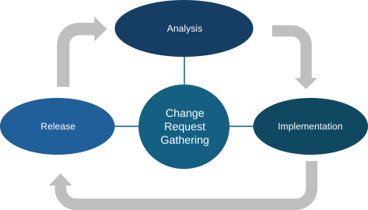
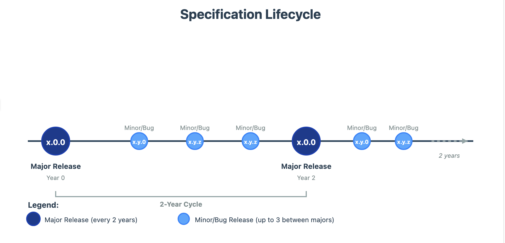

Governance & Lifecycle
======================

This section describes how the Reference Architecture is governed,
maintained, and evolved through defined governance and lifecycle
mechanisms. The evolution of the Reference Architecture follows a
user-centric, problem-solving approach, ensuring that it is continuously
maintained and adapted to provide maximum support to user needs.

The current specification, which documents the Reference Architecture,
constitutes one of its release components and is therefore subject to
the lifecycle described below. However, the maintenance of this document
has certain specific characteristics, which are addressed later in this
section.

Maintenance and evolution of the Reference Architecture
-------------------------------------------------------

To remain relevant, usable, and aligned with evolving interoperability
needs, the Reference Architecture is subject to continuous maintenance
and controlled evolution. This section describes the mechanisms through
which changes are identified, assessed, implemented, and released. It
establishes a structured change management lifecycle and a corresponding
versioning scheme, ensuring that evolution is predictable, transparent,
and aligned with user needs while preserving architectural coherence and
stability.

Change Management process - lifecycle
~~~~~~~~~~~~~~~~~~~~~~~~~~~~~~~~~~~~~

The Reference Architecture is maintained through a formal change
management process organised as a continuous cycle. This lifecycle
ensure that changes requests are systematically collected evaluated, and
implemented, while providing clarity on their scope, impact, and release
implications. The change management process consists of the following
steps:

- **Requirements gathering:** A continuous process through which
  potential improvements are gathered and classified. Each change
  request is described and categorised according to its scope
  (bug/patch, minor, or major).

- **Change requests analysis**: Based on the description and the scope,
  and the urgency of the requests, these are analysed with two
  objectives:

  - 1) to develop a detailed understanding of the proposed modifications
    and their impact on the Reference Architecture;

  - 2) to determine the type of release required (major, minor, or
    bug/patch).

- **Change requests implementation:** Following the analysis and
  approval, the identified changes are implemented in the Reference
  Architecture and its associated release components, in accordance with
  the defined scope.

- **Release:** The final step of the lifecycle, in which the updated
  Reference Architecture and its release components are formally
  published and made publicly available.

   Figure 1 Change Management Process Overview

Semantic versioning Scheme
~~~~~~~~~~~~~~~~~~~~~~~~~~

As introduced when describing the change management process, changes to
the Reference Architecture are categorised into three types in alignment
with the semantic versioning schema [12]_: major, minor.

There are three types of changes that are considered in the change
management process:

- **Major changes (Major release).** A major change affects fundamental
  aspects of the Reference Architecture. Examples include the
  restructuring of core concepts within an EIRA view that has a
  significant impact on other architectural views or policy domains.
  Such changes typically affect related solutions and implementations
  and therefore require a dedicated rollout and transition plan to
  ensure controlled adoption. Major releases are generally not backward
  compatible.

- **Minor changes (Minor Release).** A minor change is typically
  backward compatible and includes, for example, the addition of a new
  building block or a refinement of an existing definition. Minor
  releases may coexist across implementations without causing
  significant interoperability disruptions.

- **Bug/Patches (Bug Release).** A bug or patch release addresses small
  corrections, such as typographical errors, editorial issues, or
  clarifications of concepts that were previously ambiguous or
  insufficiently defined. These changes do not alter the architectural
  structure or intent.

Maintaining and evolving the Reference Architecture Specification
-----------------------------------------------------------------

This document constitutes a discrete release component of the Reference
Architecture, and therefore requires dedicated lifecycle and maintenance
provisions. The following figure shows the overall evolution logic of
the Reference Architecture and shows how the evolution of this
specification is integrated within that lifecycle.

Figure 2 Specification Lifecycle timeline

The specification is designed to support a sustainable lifecycle while
remaining aligned with the latest changes to the Reference Architecture.
To achieve this, the document deliberately minimises dependencies on
volatile elements, such as exhaustive lists of Architecture Building
Blocks (ABBs) or Solution Building Blocks (SBBs). These elements are
instead maintained as living resources in GitHub and on the
Interoperable Europe Portal.

Following the image above, a new refactored documentation will be
created to ensure the alignment with major changes (a major version) as
defined above in section `Semantic versioning
Scheme <#semantic-versioning-scheme>`__.

In addition, the specification is published and maintained online and is
made available in downloadable formats (e.g. PDF and DOCX) to support
reuse, consultation, and offline access.

Community feedback mechanisms
-----------------------------

This section describes the mechanisms and channels through which
stakeholders and users can provide feedback and propose changes to the
Reference Architecture. Community input plays a key role in ensuring
that the Reference Architecture remains relevant, practical, and aligned
with real interoperability needs. Feedback can be submitted through the
following channels.

The Interoperable Europe Portal Collection [13]_
~~~~~~~~~~~~~~~~~~~~~~~~~~~~~~~~~~~~~~~~~~~~~~~~

The Reference Architecture is made available through the
Interoperability Europe Portal, which serves as the European
Commission’s one-stop shop for the publication of interoperable
solutions.

Through the general collection for the action and the specific solution
for the Reference Architecture, users can contact the EC functional
mailbox to provide feedback. This channel enables users to submit
comments, suggestions, and requests for improvement related to the
Reference Architecture and its release components.

The Interoperable Architecture Solutions GitHub Space
~~~~~~~~~~~~~~~~~~~~~~~~~~~~~~~~~~~~~~~~~~~~~~~~~~~~~

The action also maintains a GitHub space [14]_ where the different
architecture solutions are stored, managed, and published. These
repositories constitute the authoritative source for the content
published on the Interoperable Europe Portal.

Users can provide feedback directly through these repositories by using
the GitHub Issues functionality. As all release components of the EIRA
and eGovERA are publicly available. All feedback received through GitHub
is processed in accordance with the change management process described
earlier in this specification. Regardless of the outcome of the analysis
(whether a change request leads to implementation or is rejected) users
receive a response explaining the rationale behind the decision.

References
----------

.. [12] Semantic Versioning 2.0.0 specification. https://semver.org/

.. [13] Interoperable Europe Portal. European Commission's one-stop shop for interoperable solutions. https://interoperable-europe.ec.europa.eu/

.. [14] Interoperable Architecture Solutions GitHub Repository. GitHub organization maintaining EIRA and eGovERA components. https://github.com/european-commission-empl/interoperable-europe-architecture